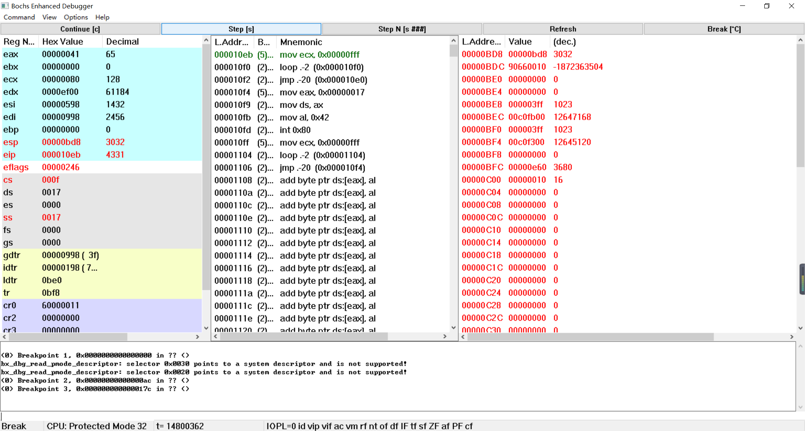
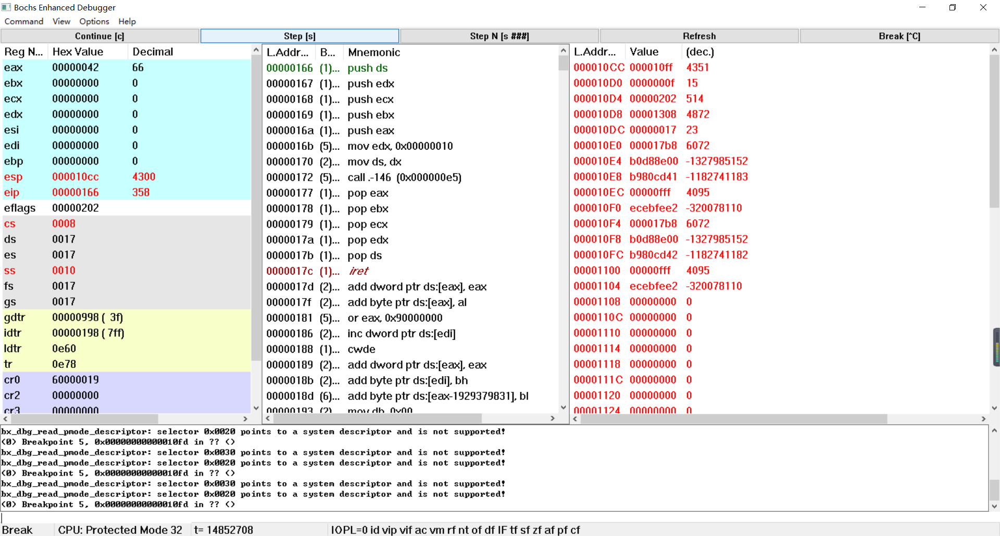

# 1. 调试分析 Linux 0.00 多任务切换
## 1.1 实验目的

- 通过调试一个简单的多任务内核实例，使大家可以熟练的掌握调试系统内核的方法；

- 掌握Bochs虚拟机的调试技巧；

- 通过调试和记录，理解操作系统及应用程序在内存中是如何进行分配与管理的
 

## 1.2. 实验报告
1. 当执行完 system_interrupt 函数，执行 153 行 iret 时，记录栈的变化情况。
执行前：

 
执行后：

在执行前后进行了栈的切换，从任务0的内核栈切换到了任务的用户栈。
 

2. 当进入和退出 system_interrupt 时，都发生了模式切换，请总结模式切换时，特权级是如何改变的？栈切换吗？如何进行切换的？ 
   1. 低特权级向高特权级切换
       - 从低特权级（如3）切换到高特权级（如0）时，有两种方式：触发异常或执行特殊指令。
       - 触发异常时，处理器会自动加载高特权级的代码段选择器（CS）和栈段选择器（SS），从而改变当前特权级（CPL）和栈。
       - 执行特殊指令时，处理器会检查目标代码段的描述符中的特权级（DPL），如果DPL小于或等于CPL，则允许跳转，并将目标代码段选择器加载到CS中，从而改变CPL。
    2. 高特权级向低特权级切换
       - 从高特权级（如0）切换到低特权级（如3）时，必须使用iret指令，并手动创建符合iret指令期望的栈结构（ss, esp, eflags, cs && eip），然后调用iret。
       - iret指令会从栈中弹出ss, esp, eflags, cs && eip，并将它们加载到相应的寄存器中，从而改变当前特权级（CPL）和栈指针。
 
下面为进入system_interrupt前，进入system_interrupt后，退出system_interrupt后的栈以及寄存器的变化

 

3. 当时钟中断发生，进入到 timer_interrupt 程序，请详细记录从任务 0 切换到任务 1 的过程。
   
    
    当进入任务0后，大概率会在226行发生时钟中断，此时任务号为0，当发生时钟中断后，从119行开始执行，在137行，由于此时任务号为0，所以不会发生跳转，会继续执行128行，将任务号改为1，然后在129运行到任务1的TSS,将各个寄存器的值修改为任务1的相关的值，即可跳转到任务1.
 

4. 又过了 10ms ，从任务1切换回到任务 0 ，整个流程是怎样的？ TSS 是如何变化的？各个寄存器的值是如何变化的？ 
 
在第3题中，我们跳转到了任务1，从代码段228行开始执行，大概率在232行发生时钟中断，进入 timer_interrupt 程序，在126行比较时，由于此时任务号为1，所以跳转到131行，将任务号设为0，在132行处，加载任务0的TSS。由于任务0是在执行到129行时发生跳转，所以加载完任务0的TSS后，应从130行开始执行，再跳转到133行，弹栈后通过iret返回，由于上次为在226行触发时钟中断，所以回到226行。 
TSS与各个寄存器的值的变化如下图所示：

 
可以明显的看到tr和ldtr发生了变化，可以侧面说明发生了任务切换。
 

5. 请详细总结任务切换的过程

当进入任务0后，大概率会在226行发生时钟中断，此时任务号为0，当发生时钟中断后，从119行开始执行，在137行，由于此时任务号为0，所以不会发生跳转，会继续执行128行，将任务号改为1，然后在129运行到任务1的TSS,将各个寄存器的值修改为任务1的相关的值，即可跳转到任务1. 
跳转到了任务1，从代码段228行开始执行，大概率在232行发生时钟中断，进入 timer_interrupt 程序，在126行比较时，由于此时任务号为1，所以跳转到131行，将任务号设为0，在132行处，加载任务0的TSS。由于任务0是在执行到129行时发生跳转，所以加载完任务0的TSS后，应从130行开始执行，再跳转到133行，弹栈后通过iret返回，由于上次为在226行触发时钟中断，所以回到226行。 
然后又会大概率在226行，再次发生时钟中断，从119行开始执行，在137行，由于此时任务号为0，所以不会发生跳转，会继续执行128行，将任务号改为1，然后在129运行到任务1的TSS,将各个寄存器的值修改为任务1的相关的值，由于上次任务1是在132行发生任务切换，所以会从从133行开始执行，到iret返回至232行。 
然后又会大概率在232行发生时钟中断.....以此不断循环往复。
